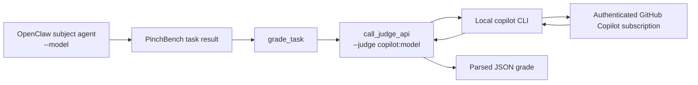

# GitHub Copilot CLI Judge Integration for PinchBench

**Status:** Implemented and exercised in a full 147-task PinchBench evaluation on 2026-07-20/21.
**Judge path:** Local GitHub Copilot CLI authenticated through the user's Copilot subscription.
**Pinned model used for the completed run:** copilot:gpt-5.4-mini.

This guide documents the integration that is in this repository now. It uses Copilot as the **judge** that evaluates task outcomes; it does not make Copilot the OpenClaw agent model being benchmarked.

## What is integrated

When --judge copilot... is supplied, PinchBench invokes the standalone copilot executable directly. It does not start Codex, an OpenClaw judge agent, or an API-key-based Copilot service.



The CLI receives a grading prompt containing the task, rubric, summarized agent transcript, and applicable workspace evidence. It must return one JSON object, which PinchBench parses into the LLM-judge score. Hybrid tasks combine that score with their automated score in the normal way.

## Supported judge identifiers

| --judge value | Copilot CLI behavior | Recommended use |
|---|---|---|
| copilot | Uses the Copilot CLI's configured/default model; no --model is passed. | Exploratory testing only. |
| copilot:auto | Passes --model auto; Copilot selects an available model. | First smoke test. |
| copilot:<model> | Passes <model> unchanged to Copilot's --model option. | Reproducible benchmark runs. |

For example, --judge copilot:gpt-5.4-mini results in copilot --model gpt-5.4-mini. PinchBench deliberately does not maintain its own model allowlist: availability is decided by the authenticated Copilot account and any organization policy. If a model is unavailable, Copilot returns an error and PinchBench records a failed judge response.

Use a pinned model for a benchmark you intend to compare or publish. auto is useful for verification but can select a different judge model later.

## Prerequisites and installation

1. An account with a Copilot subscription or organizational entitlement.
2. The standalone GitHub Copilot CLI available on PATH.
3. A completed copilot login for the same Unix user that launches PinchBench.

On this host, Codex Desktop's bundled Node runtime has a global npm prefix under /opt/codex-desktop/...; it is not writable by the ordinary user. Do not install the judge CLI into that prefix with sudo. Install it under the user's home directory instead:

```bash
mkdir -p "$HOME/.local/bin"
NPM_CONFIG_PREFIX="$HOME/.local" npm install -g @github/copilot

# Add this to ~/.bashrc or ~/.profile if it is not already present.
export PATH="$HOME/.local/bin:$PATH"
hash -r

copilot --version
copilot login
```

The tested installation resolves to /home/intel/.local/bin/copilot (Copilot CLI 1.0.73). A system-specific version or install path may differ.

If npm install -g @github/copilot fails with EACCES while trying to write under /opt/codex-desktop/resources/node-runtime, use the user-local command above. Installing with sudo can leave a root-owned package attached to the desktop runtime and is not the supported PinchBench setup.

## Preflight

Confirm that login and the chosen model work before starting a benchmark:

```bash
copilot -sp 'Return only OK' --model auto \
  --allow-all-tools --available-tools=

copilot -sp 'Return only OK' --model gpt-5.4-mini \
  --allow-all-tools --available-tools=
```

The CLI requires --allow-all-tools for non-interactive execution. The empty --available-tools= allowlist means there are no tools for the model to use. PinchBench applies the same principle, plus disables custom instructions, built-in MCP servers, temporary-directory access, and remote session features.

If the command reports "You have exceeded your monthly quota", authentication is working but the account does not currently have usable Copilot allowance. Wait for quota renewal or select a model/plan with available allowance; adding an API_KEY does not extend the Copilot subscription quota.

## Running PinchBench

### One-task smoke test

Use a small scoped run before a full suite. Replace the subject model with the model that OpenClaw should execute as the agent under test.

```bash
./scripts/run.sh \
  --model lemonade/Qwen3.6-35B-A3B-MTP-GGUF \
  --judge copilot:auto \
  --suite task_email \
  --runs 1 \
  --no-upload \
  --output-dir results/copilot_smoke
```

### Reproducible full run

```bash
./scripts/run.sh \
  --model lemonade/Qwen3.6-35B-A3B-MTP-GGUF \
  --judge copilot:gpt-5.4-mini \
  --suite all \
  --runs 1 \
  --no-upload \
  --output-dir results/lemonade_qwen3_6_35b_spec_copilot_gpt54mini_YYYYMMDD
```

--judge changes only the grading backend. The --model argument remains the subject agent model. With --judge omitted, LLM grading instead uses the default OpenClaw judge-agent session.

PinchBench creates a background grading thread by default and snapshots the completed task's workspace before grading. It waits for that grade at the next task-loop boundary before recording progress, so a slow or failed judge can delay visible task progress. Use --no-parallel-judge when debugging sequentially.

## Implementation details

The production call path is implemented in:

- [scripts/benchmark.py](scripts/benchmark.py): accepts --judge and selects the direct judge backend when it is set.
- [scripts/lib_grading.py](scripts/lib_grading.py): builds the grading prompt, manages retries, parses the JSON response, combines hybrid scores, and caches valid grades.
- [scripts/lib_agent.py](scripts/lib_agent.py): dispatches copilot and copilot:* identifiers to _judge_via_copilot_cli().

The adapter invokes the CLI approximately as follows (the rubric and evidence are supplied on standard input, not placed on the command line):

```text
copilot --silent --no-color --stream off \
  --allow-all-tools --no-ask-user --no-custom-instructions \
  --disable-builtin-mcps --disallow-temp-dir \
  --no-remote --no-remote-export --available-tools= \
  [--model <requested-model>]
```

--silent and --stream off keep the output suitable for the JSON parser. Sending the prompt through stdin avoids shell quoting and operating-system command-line length limits. The CLI subprocess timeout is 300 seconds by default (DEFAULT_JUDGE_TIMEOUT_SECONDS).

## Evidence and Copilot context limits

The first full run demonstrated why workspace evidence must be considered part of the judge configuration. For task 39 (task_video_transcript_extraction), including a 2.97 MB video.info.json artifact made the Copilot prompt about 1,488,815 tokens. Copilot rejected it with:

```text
400 prompt token count of 1488815 exceeds the limit of 272000
```

The completed integration handles this condition as follows:

1. It first preserves the normal full-workspace evidence behavior.
2. If a Copilot error matches "prompt token count ... exceeds the limit ...", it retries once with evidence-aware reduction.
3. For task_video_transcript_extraction, the retry includes only transcript.txt and video_summary.md; raw downloader metadata and subtitle artifacts are excluded.
4. For other tasks without an explicit allowlist, the fallback caps evidence at 64,000 characters per file and 192,000 characters total.

This evidence-aware retry regraded task 39 successfully at 0.800 and allowed the remaining 108 tasks to complete. It is deliberately reactive: ordinary tasks retain full evidence; only a genuine Copilot context-limit error enables the reduced-evidence retry.

The Copilot CLI exposes a --context long_context option, but PinchBench does not set it today, and it must not be treated as a guarantee that a prompt above the service limit will be accepted. Reducing irrelevant raw artifacts is the reliable mitigation. Add a task-specific allowlist whenever a task produces a large machine-generated intermediate file that is not needed by its rubric.

## Failure behavior and troubleshooting

| Symptom | PinchBench behavior | Resolution |
|---|---|---|
| copilot CLI not found | Judge response fails; no fallback to OpenClaw or another provider occurs. | Install in $HOME/.local, expose $HOME/.local/bin on PATH, and restart the shell/process. |
| Copilot model cannot be empty | --judge copilot: is rejected immediately. | Use copilot, copilot:auto, or copilot:<actual-model>. |
| copilot exit ... model unavailable | The grade has no parseable response and scores zero for that LLM grade. | Check copilot --help, login/account entitlement, organization policy, and use an available model. |
| copilot timed out | A normal transient retry is attempted once; if still unsuccessful the LLM grade is zero. | Check Copilot service/network health; reduce judge evidence or increase the code-level timeout if justified. |
| exceeded your monthly quota | Classified as quota_exceeded; PinchBench does **not** retry. | Restore Copilot allowance before resuming. A retry only wastes allowance and time. |
| prompt token count ... exceeds the limit ... | One evidence-aware retry is made automatically for Copilot judges. | Inspect workspace artifacts; add a rubric-aligned allowlist for the task if needed. |
| JSON parse failure | The run records "LLM judge failed: no parseable response after all attempts". | Re-run the affected task after confirming the CLI returns only the JSON object. |

Judge failures are not silently converted to a different provider. This is intentional: a benchmark must record the configured judge path truthfully.

## Caching, artifacts, and resuming

- Successful judge grades are cached using task ID, transcript summary, rubric, judge model identifier, and workspace evidence. Changing the judge model or evidence changes the cache key.
- Agent transcripts are archived under results/<run-id>_transcripts/task_<id>.jsonl.
- Incremental result JSON is written while the run is active. Preserve it, the benchmark log, and archived transcripts if a run must be resumed or audited.
- A stopped run cannot be assumed to have a final results JSON. In the 2026-07-21 evaluation, the first 38 grades were reconstructed from the preserved log, task 39 was regraded from preserved artifacts, and ordinals 40–147 came from a completed continuation JSON.

## Validation performed

The integration has unit coverage for:

- copilot default-model dispatch and its safe no-tool CLI options;
- model forwarding (copilot:auto);
- empty model suffix, missing CLI, timeout, and nonzero exit handling;
- quota-exhaustion classification with no retry;
- task-39 context-limit detection and evidence-aware retry; and
- preservation of full workspace content before a context-limit failure.

Run the relevant tests with:

```bash
PYTHONPATH=scripts .venv/bin/python -m unittest \
  tests.test_lib_agent_judge tests.test_lib_grading
```

The full native run using copilot:gpt-5.4-mini covered all 147 ordinals and produced **122.1 / 147.0 (83.1%)**. Its combined report is available at [copilot-grade/copilot_grades/0017_0018_native_report_FINAL_001_147_0721.md](copilot-grade/copilot_grades/0017_0018_native_report_FINAL_001_147_0721.md).

## Boundaries

- This route uses a **Copilot subscription**, not OPENAI_API_KEY, OPENROUTER_API_KEY, or a simulated API key.
- Subscription access does not remove Copilot model availability, quota, or context-window limits.
- The user selects a Copilot model by using its Copilot CLI model name after copilot:. PinchBench cannot register arbitrary external/BYOK models into Copilot.
- Scores from a Copilot judge are judge-specific. Keep the judge model and benchmark version fixed when comparing runs.
